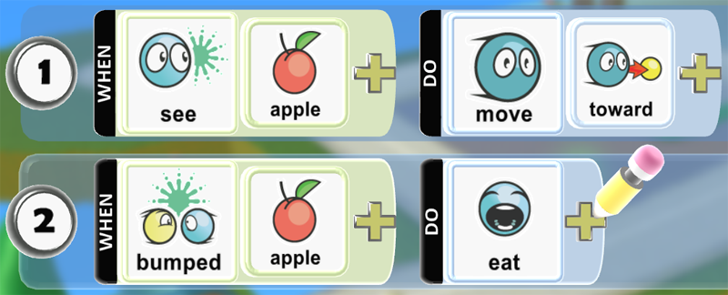

   

  Kodu Game Lab is a 3D game development environment that is designed to teach kids basic programming principles. Kodu allows creators to build the world's terrain, populate it with characters and props, and then program their behaviors and games rules in a bespoke visual programming language.  
  
  Kodu originated as a project in Microsoft Research. The original target platform was the Xbox 360 using C#, XNA, and releasing via the Indie Games Channel. The choice of releasing on the Xbox informed much of the early UI development since everything needed to be done using a game controller. Since porting to the PC, support for keyboard, mouse, and touch have been added.  
  
  The goal for Kodu has always been to be as easy as possible for new users. Guided by this goal, we've tended to design new features so that they are simple and understandable rather than more complex and complete.

The heart of Kodu is the tile-based programming language. The language is high level in the sense that a lot can be accomplished in a very few lines of "kode" compared to traditional programming.  The kode is continuously evaluated so that it immediately reacts to any changes in the state of the world.  For instance, the sample below shows how to program a character to find and eat all the apples in the game world.  Line 1 says that if the character sees an apple, it should move toward it.  If there is more than one apple in the world, it automatically chooses the nearest to move toward.  Line 2 says that when the character bumps into the apple, it should eat it.  The **bumped** tile is Kodu's way of telling when two characters are close to each other.  Once the apple is eaten, it no longer exists in the world, so the character will then go after the next one and so on until no more apples remain.

Having the tiles represent real-world events, actions, and objects helps bridge the gap between a new user's real-world experience and the often abstract nature of computer programming.

## [Download Kodu](downloads)

## [Classroom Resources](resources)
## [Videos](resources#videos)
## [Tip and Tricks](tips)
## [Privacy Statement](privacy)
## [EULA and Code of Conduct](EULA)

## Questions?
For questions or any support issues, email <KoduSupport@InfiniteInstant.com>.

