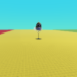
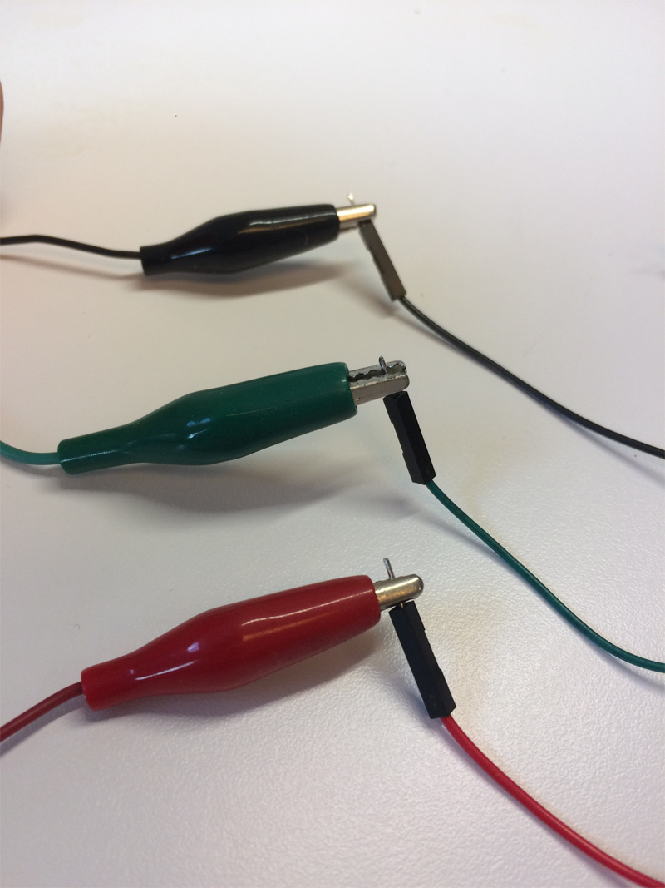
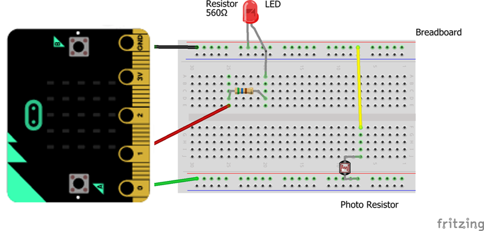
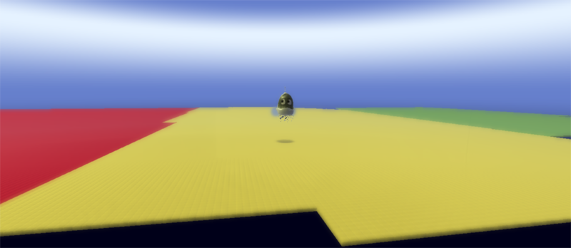
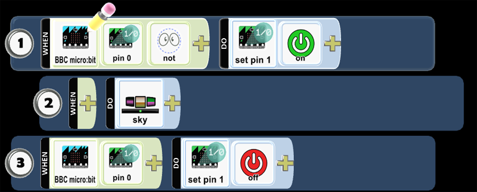
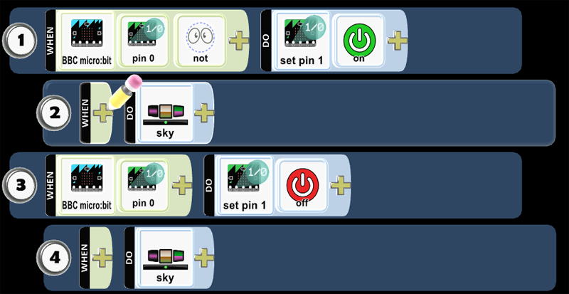

---
title:
subtitle:
layout: page
show_sidebar: false
hide_hero: true
---

[Home](../..)/[Resources](..)/Stoplight

  

## Stoplight

* Project 7: Stoplight
* Student Ages: 09-14 years old
* Activity Time: 60 minutes 
* Activity Level: Beginner Coder

### Prerequisites
* Download and Installation of Kodu
* Get Started Instructions: [BBC micro:bit](microbit)
  * Connect your micro:bit to a computer via USB cable
  * Install the [mbed serial port driver](https://developer.mbed.org/media/downloads/drivers/mbedWinSerial_16466.exe)
  * Start Kodu (version 1.4.84.0 or later). It will detect your micro:bit and enable the micro:bit programming tiles.
  * [Project 1: Capture Love](capture_love)
  * [Project 2: Jump](jump)
  * [Project 3: Reach Castle](reach_castle)
  * [Project 4: Bucket Toss](bucket_toss)
  * [Project 5: Twinkle](twinkle)
  * [Project 6: Underwater Explorer](underwater_explorer)
    

### Learning Objectives
* Create a Kodu world to control the Sky in game using BBC micro:bit PO and P1 on the BBC micro:bit and a photoresistor.

### Contents
* [Completed World: Stoplight](https://www.kodugamelab.com/worlds/#6JLpFERH20i-DQV897XDLQ==)
* Project: Stoplight

### Student Activities
To create a Kodu world using tiles specific the BBC micro:bit, make sure you connect a micro:bit device and install the mbed serial port driver

**Welcome! This activity will teach you how to control the Sky with the micro:bit P0. Let's get started!**

#### Materials

* BBC micro:bit, Micro USB cable
* Photoresistor 
* Resistor (560 Ohm)
* Crocodile clips
* Male-Male Jumper wires

### Make Steps
#### Step 1: Jumper Cables

Connect one side of a Crocodile clip to GND on the micro:bit (usually black). Connect one side of a second Crocodile clip to P0 on the micro:bit (usually red). Connect one side of a third Crocodile clip to P1 on the micro:bit.

#### Step 2: Male-Male Jumper wires

Attach Crocodile clips to Male-Male Jumper wires (usually matching colors).

 

#### Step 3: Breadboard

LED is connected to Pin 1 (P1), and between this link there’s a resistor.
Photoresistor is connected to Pin 0 (P0) and Ground respectively.

### Code Steps
#### Step 1: Add an Object

Start Kodu Game Lab. Select the New World option from the Main Menu, and Kodu Game Lab will open and display a patch of ground directly in the center of the screen.

Select the Object tool (the Kodu icon on the toolbar). Move the mouse pointer to the center of the terrain and click and release the left mouse button, which opens the pie menu. Use the mouse to select your moving object, such as Kodu.

#### Step 2: Program Kodu - P0 Set Current State On

You want to Kodu to respond to the BBC micro:bit input. Let's explain the first line.

Pin 0 - Read state of BBC micro:bit pin 0.
Not - React when the when condition doesn't match.
Set Pin 1. Sets the digital output state of the pin.
On - Set the current state to on.
 

#### Step 3: Program Kodu - Change the Sky

Move line 2 to be underneath line 1. This will make line 2 a child to 1. When Pin 0 is not on, the micro:bit will set pin 1 on. When pin 1 is on, the Sky is 10.

#### Step 4: Program Kodu - P0 Set Current State Off

You want to Kodu to respond to this BBC micro:bit input. Let's explain the line 3.

Pin 0 - Read state of BBC micro:bit pin 0.
Set Pin 1. Sets the digital output state of the pin.
Off - Set the current state to off.
 

#### Step 5: Program Kodu - Change the Sky

Move line 4 to be underneath line 3. This will make line 4 a child to 3. When you set Pin 1 on, the Sky will be 11

* Play Game and cover then uncover the photoresistor to see if the code works as expected.

### Skills
Character,
Citizenship,
Collaboration,
Communication,
Creativity,
Critical Thinking,
Project Based Learning

