---
title:
subtitle:
layout: page
show_sidebar: false
hide_hero: true
---

[Home](../..)/[Resources](..)/Underwater Explorer

[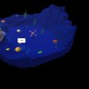](https://www.kodugamelab.com/worlds/#y3WUJyKvXEWPz8zDsWWayA==)

  

## Underwater Explorer

* Project 6: Underwater Explorer
* Student Ages: 09-14 years old
* Activity Time: 60 minutes 
* Activity Level: Beginner Coder

### Prerequisites
* Download and Installation of Kodu
* Get Started Instructions: [BBC micro:bit](microbit)
  * Connect your micro:bit to a computer via USB cable
  * Install the [mbed serial port driver](https://developer.mbed.org/media/downloads/drivers/mbedWinSerial_16466.exe)
  * Start Kodu (version 1.4.84.0 or later). It will detect your micro:bit and enable the micro:bit programming tiles.
  * [Project 1: Capture Love](capture_love)
  * [Project 2: Jump](jump)
  * [Project 3: Reach Castle](reach_castle)
  * [Project 4: Bucket Toss](bucket_toss)
  * [Project 5: Twinkle](twinkle)
   

### Learning Objectives
* Create a storytelling Kodu world with using BBC micro:bit Say and Hear.

### Contents
* [Completed Kode for Level: Underwater Explorer](https://kodu.blob.core.windows.net/kodu/Resources/Underwater_Explorer_Kode_for_Level.pdf)
* [Completed World: Underwater Explorer](https://www.kodugamelab.com/worlds/#MN5Pc1jIrE-QTHUlAHCJgg==)
* Project: Underwater Explorer - Sputnik collects objects such as Starfish and Clams (micro:bit say)

### Student Activities
To create a Kodu world using tiles specific the BBC micro:bit, make sure you connect a micro:bit device and install the mbed serial port driver

**Welcome! This activity will teach you how to scroll text on the micro:bit display. Let's get started!**

#### Step 1: Add Objects

Start Kodu Game Lab. Select the New World option from the Main Menu, and Kodu Game Lab will open and display a patch of ground directly in the center of the screen.

* For mouse users, move the mouse pointer to the center of the terrain and click and release the left mouse, which open the pie menu. Use your mouse to select the Sputnik object or another moving object (except Rover).
* For game controller users, move the camera to the center of the terrain and press the A button, which open the pie menu. Use the game controller to select the object. Use your game controller to select Sputnik or another moving object (except Rover). After adding the object to the terrain, press button B for the Tool Menu.

Finally, you will want to the Ship add non-moving underwater objects such as Starfish and Clam

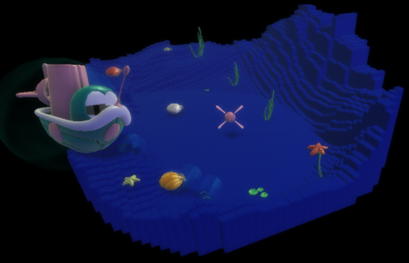

#### Step 2: Program Sputnik - Move

You want to move Sputnik using the BBC micro:bit tilt. 

* Using a mouse, select the Object tool and right-click the mouse on the object, Kodu. Select the Program option for Kodu. Select the When box with left-click of the mouse.
* Using a game controller, use the Object tool and move the control circle over the object and press Y button. Press the A button on the When box.

Sputnik uses the accelerometer on the BBC micro:bit. The accelerometer detects movement on the BBC micro:bit with tilt. The accelerometer detects changes in the micro:bit’s speed and detects a standard action such as tilt. You use tilt to register an event that will run when a tilt event happens.

Alternatively, Kodu can use the L-stick on the Wired Controller or Keyboard Up/Down/Lt/Rt to move.

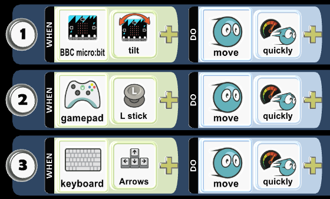

#### Step 3: Program Sputnik - Vanish Clam

Let's program Sputnik to vanish the Clam when Sputnik bumps it. 

#### Step 4: Program Sputnik - Speech Bubble Say

You want to tuck programming Row 3 underneath 2 so any programming placed in 2 is always being checked for a condition that will trigger the action. Row 3 moves to the right and is a child of 2. Click the 3 and hold down the mouse button while dragging to the right.  

When Sputnik bumps the Clam, let's add say! This will display a message in a balloon. Left click on say and type the message that will appear then click Save. 

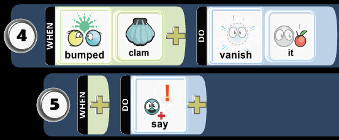

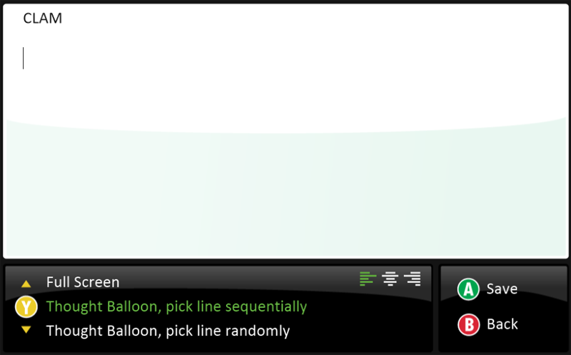

#### Step 5: Program Sputnik - BBC micro:bit Say

Let's add micro:bit say when Sputnik bumps the Clam, which will scroll text on the micro:bit display. Type the message that will appear on the micro:bit display then click OK.   

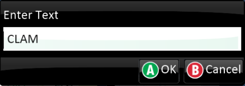

* Play Game to see if the code works as expected.

#### Step 6: Program Sputnik - Vanish Starfish

Let's program Sputnik to vanish the Starfish when Sputnik bumps it.  

* Play Game to see if the code works as expected.

#### Step 7: Program Sputnik - Thought Bubble Say

Let's add Say and edit Say to type the message that appears in a bubble when a Sputnik bumps Starfish! 

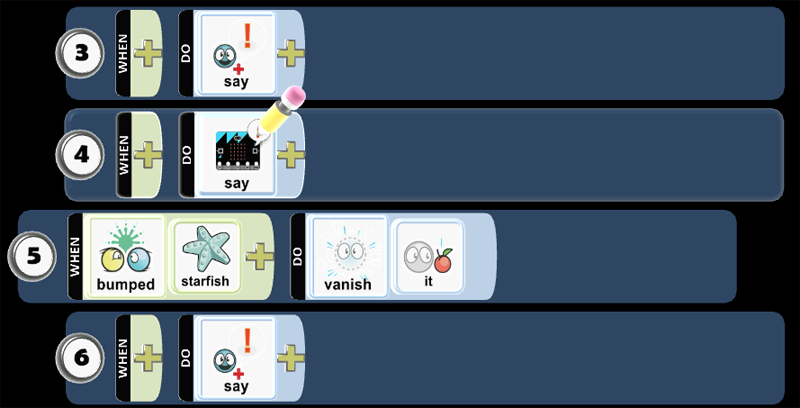

 

#### Step 8: Program Sputnik - BBC micro:bit Say

Let's add Say to scoll a message on the micro:bit when Sputnik bumps the Starfish! Left click on on Say to enter text, then click OK. 

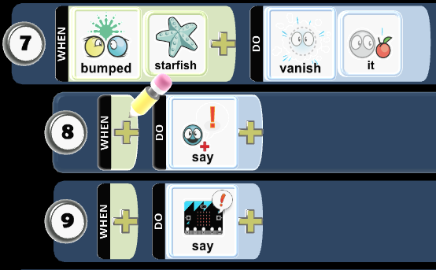

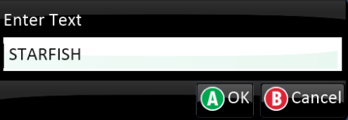 

* Play Game to see if the code works as expected.

#### Step 9: Program Ship - Thought Bubble Say

You want to add interactions between you and the Ship. Let's program the Ship to see when Clam is not in the world. When Clam is not in the world, then the Ship says a message once! Left click on say the enter the message then press Save. 

* Play Game to see if the code works as expected.

#### Step 10: Program Ship - BBC micro:bit Say

You want to tuck programming Row 2 underneath 1 so any programming placed in 2 is always being checked for a condition that will trigger the action. Row 2 moves to the right and is a child of 1. Click the 2 and hold down the mouse button while dragging to the right.

Let's add micro:bit say when Ship does not see the Clam! You want to scroll text on the micro:bit display. Type the message that will appear on the micro:bit display then click OK.

#### Step 11: Program Ship - Thought Bubble Say

You want to add another interaction between you and the Ship. Let's program the Ship to see when Starfish is not in the world. When Starfish is not in the world, then the Ship says a message once!

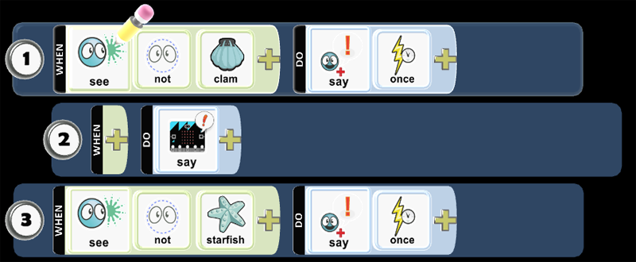

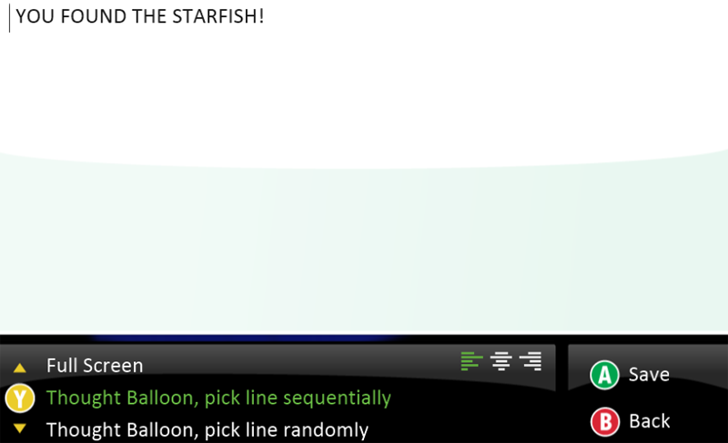 

* Play Game to see if the code works as expected.

#### Step 12: Program Ship - BBC micro:bit Say

Let's add micro:bit say when Ship does not see the Starfish! You want to scroll text on the micro:bit display. Type the message that will appear on the micro:bit display then click OK.

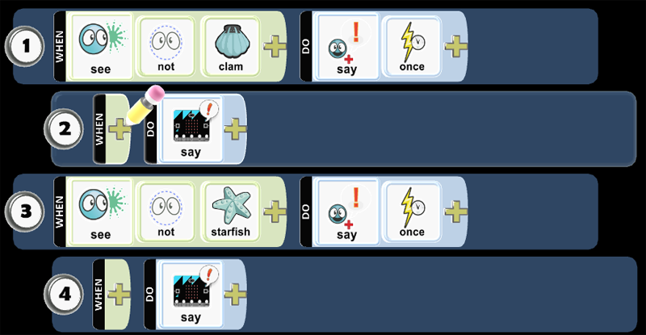

* Play Game to see if the code works as expected.

#### Step 13: Save World

You want to save your work. The Game Save Screen is useful in managing the game development. You go to Home Menu then select Save my world. You want to type the game name in the Name field and describe the gameplay as well as rules of the game in the Description field, then click or press Save. You want to type the game name in the Name field and describe the gameplay as well as rules of the game in the Description, then click or press Save. Finally, you want to select Change World Settings, scroll down to Start Game With, and select Description with Countdown.

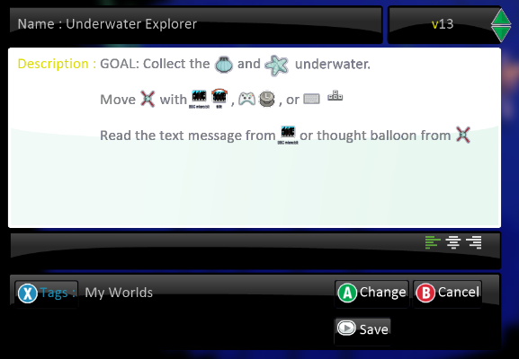

* Play Game to see if the directions appear as expected.

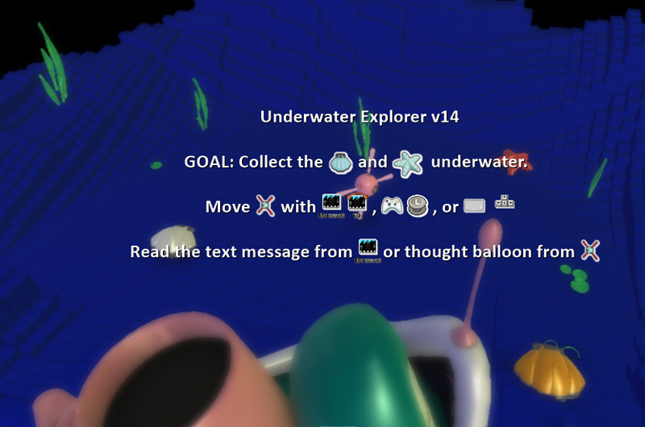

### Skills
Character,
Citizenship,
Collaboration,
Communication,
Creativity,
Critical Thinking,
Project Based Learning

