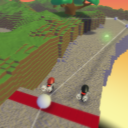

[Home](..)/[Resources](.)/Collaborative Game Development

## Collaborative Game Development
 

* [Lesson plan 3: Kodu Makerspace Club Session 3](LG_Session_3_KODU_Makerspace.pdf)
* [Slides for session 3 and PowerPoint source](PPT_Session3_Kodu_Makerspace.pdf)
* Student Ages: 9-14 years old
* Activity Time: 120 minutes
* Activity Level: Beginner Coder

### Learning Objectives
* Students will begin transforming their game plans into a working game.
* Students will collaborative teams to share their first game draft in the second half of the session.
* Students will gather and assess feedback for consideration in their second game draft.

### Contents
* [Leader Guide Session 3 Kodu Makerspace](LG_Session_3_KODU_Makerspace.pdf)
* [Slides for Leader Guide Session 3 Kodu Makerspace](PPT_Session3_Kodu_Makerspace.pdf)
* [Student Workbook](Student_Workbook_Kodu_Makerspace_Camp.pdf)

### Student Activities
[Section 1: Introduction]() 
The students review the programming concepts learned from previous sessions. 
*Subjects: Design Technology, Digital Literacy, 21st Century Learning Skills*

[Section 2: Collaboration Game Development]() 
The students review their ideas for revising their game. Students will work with a partner to create a game. Students will share their game plans. Students will get ideas for their game from others. Students will make changes to their game. 
*Subjects: Design Technology, Digital Literacy, 21st Century Learning Skills*

[Section 3: The Feedback Loop]() 
The students will complete a first draft show and tell. The students will have feedback assessment and tweak their designs. 
*Subjects: Design Technology, Digital Literacy, 21st Century Learning Skills*

[Section 4: Wrap Up]() 
The students will reflect on concepts learned from the session. 
*Subjects: Design Technology, Digital Literacy, 21st Century Learning Skills*

### Skills
Character,
Citizenship,
Collaboration,
Communication,
Creativity,
Critical Thinking,
Project Based Learning 

    
