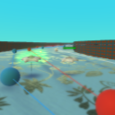

[Home](..)/[Resources](.)/Game Mechanics

## Game Mechanics
 

* [Week 3: Game Mechanics](PKDesignCourse_WeekThree.pdf)
* Student Ages: 9-14 years old
* Activity Time: 60 minutes
* Activity Level: Beginner Coder

### Prerequisites 
* Download and Installation of Kodu
* [Getting Started with Kodu](getting_started_with_kodu)
* [Rapid Prototyping](rapid_prototyping)

### Learning Objectives
* Students will have an exploration of how to develop game objectives, rules, actions, and secrets.

### Contents
* [Game Mechanics](PKDesignCourse_WeekThree.pdf)
* [Complete Game: Neo Battle Racers](https://www.kodugamelab.com/worlds/#O0Qlh0XHf06FrpZzMuqvJg==) Racing Shooter

### Student Activities
[Designing challenge and engagement](PKDesignCourse_WeekThree.pdf#page=2) 
Students will learn various ways to design challenging and engaging games, which includes: character driven games; ticking clock game; open ended game; object driven game; games with team play; games which build intensity. 
*Subjects: Design Technology, Digital Literacy, 21st Century Learning Skills*

[Developing your game rules](PKDesignCourse_WeekThree.pdf#page=3) 
Students will learn the importance of building a world with consistency and changing the rules on the player. 
*Subjects: Design Technology, Digital Literacy, 21st Century Learning Skills*

[Secrets](PKDesignCourse_WeekThree.pdf#page=4) 
Students will learn the idea of revealing secrets in the game. 
*Subjects: Design Technology, Digital Literacy, 21st Century Learning Skills*

[Objects, Attributes, and States](PKDesignCourse_WeekThree.pdf#page=7) 
Students will learn about the objects, attributes, and states in Kodu Game Lab. 
*Subjects: Design Technology, Digital Literacy, 21st Century Learning Skills*

### Performance Expectations
[Task 3](PKDesignCourse_WeekThree.pdf#page=9) 
Students will review and asess the design quality of their own game or one someone else has made such as the Kodu world, Neo Battle Racers. 
*Subjects: Design Technology, Digital Literacy, 21st Century Learning Skills*

### Skills
Character,
Citizenship,
Collaboration,
Communication,
Creativity,
Critical Thinking,
Project Based Learning 
