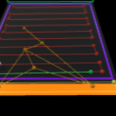

[Home](..)/[Resources](.)/Kodu Curriculum Getting Started with Xbox Controller

## Kodu Curriculum Getting Started with Xbox Controller
 

* [Module 2: Getting Started with Xbox Controller](2_Kodu_Curriculum_Getting_Started_XBox_Controller.pdf)
* Student Ages: 9-14 years old
* Activity Time: 40 minutes
* Activity Level: Beginner Coder

### Prerequisites 
* Download and Installation of Kodu
* Xbox Controller

### Learning Objectives
* Students will learn to enter a program, explore a world, view code, and create terrain.

### Contents
* [Kodu Curriculum Getting Started with Xbox Controller](2_Kodu_Curriculum_Getting_Started_XBox_Controller.pdf)
* [Kodu Curriculum Appendix](Kodu_Curriculum_Appendix.pdf)
* [Kodu World: Xevon](https://www.kodugamelab.com/worlds/#unirU5NOr0-dpWPpFyAt1g==)

### Student Activities
[Load World](2_Kodu_Curriculum_Getting_Started_XBox_Controller.pdf#page=1) 
The students will load world. 
*Subjects: Design Technology, Digital Literacy, 21st Century Learning Skills*

[Exploring the Worlds](2_Kodu_Curriculum_Getting_Started_XBox_Controller.pdf#page=2) 
The students will select an Existing World such as the Kodu world, Xevon. 
*Subjects: Design Technology, Digital Literacy, 21st Century Learning Skills*

[Viewing the Code](2_Kodu_Curriculum_Getting_Started_XBox_Controller.pdf#page=6) 
The students will view the code and move an object. 
*Subjects: Design Technology, Digital Literacy, 21st Century Learning Skills*

[Creating a New World - Terrain and Characters](2_Kodu_Curriculum_Getting_Started_XBox_Controller.pdf#page=5) 
The students will make terrain, mainipulate the terrain as well as add elevation and water. 
*Subjects: Design Technology, Digital Literacy, 21st Century Learning Skills*

### Skills
Character,
Citizenship,
Collaboration,
Communication,
Creativity,
Critical Thinking,
Project Based Learning 
