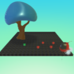

[Home](..)/[Resources](.)/Koding Kodu

## Koding Kodu
 

* [Lesson plan 3: Koding Kodu]()
* Student Ages: 9-14 years old
* Activity Time: 60 minutes
* Activity Level: Beginner Coder

### Prerequisites 
* Download and Installation of Kodu
* [Lesson 1: Introduction to Kodu Touch](introduction_to_kodu_touch)
* [Lesson 2: Placing and Customizing Objects](placing_and_customizing_objects)

### Learning Objectives
* Instruct an object to perform a task based on an event-driven paradigm by using a When...Do... statement.
* Add tiles to a Do… section to represent an action.
* Select from a set of given instruction tiles to perform a task.

### Contents
* [Lesson 3: Koding Kodu](Kodu_Touch_Primer_Lesson_3.pdf#page=1)
* [Starter World: Kodu Touch Lesson 3 (Kodu eats all the apples)](https://www.kodugamelab.com/worlds/#z1iDdhN3PkSfHiJlgExGCA==)
* [Koloring Kodu](Koloring_Kodu.pdf)
* [Kodu Kode Puzzle](Kodu_Kode_Puzzle.pdf)

### Student Activities
[Activator: Kodu Role-play](Kodu_Touch_Primer_Lesson_3.pdf#page=1) 
The teacher tells the class to act out the following behaviors using the model they made in Lesson 2. When Kodu sees an apple, it moves towards the apple. When Kodu bumps into an apple, it eats it.
Subjects: Design Technology, Digital Literacy, 21st Century Learning Skills

[Kodu Kode Puzzle](Kodu_Touch_Primer_Lesson_3.pdf#page=1) 
The teacher has the class cut out the set of Kodu tiles and lead them through placing them in the right spots on the worksheet to match.
Subjects: Design Technology, Digital Literacy, 21st Century Learning Skills

[Koding Kodu](Kodu_Touch_Primer_Lesson_3.pdf#page=1) 
The teacher can demo the Kodu world example. Then then students will replicate the Kodu kode they created in the Kodu Tile Puzzle activity in Kodu Game Lab.
Subjects: Design Technology, Digital Literacy, 21st Century Learning Skills

### Skills
Character,
Citizenship,
Collaboration,
Communication,
Creativity,
Critical Thinking,
Project Based Learning 

