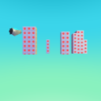

[Home](..)/[Resources](.)/Length, Width, Area, and Perimeter

## Length, Width, Area, and Perimeter
  

* [Lesson 2: Length, Width, Area, and Perimeter](6_Kodu_Curriculum_Math_Module.pdf#page=19)
* Student Ages: 8-14 years old
* Activity Time: 50 minutes 
* Activity Level: Beginner Coder

### Prerequisites
* Download and Installation of Kodu
* [Lesson 1: Growing Squares](growing_squares)
* Lesson 2: Print From Curriculum Guide:  
  * Student Activity: [Area and Perimeter](6_Kodu_Curriculum_Math_Module.pdf#page=23) (1 per student)
  * Student Activity: [Area and Perimeter](6_Kodu_Curriculum_Math_Module.pdf#page=22) (Teacher Key) 

### Learning Objectives

* Students will create a three-dimensional object from two-dimensional representations when given the length, width, and height measurements for quadrilaterals.
* Students will measure a three-dimensional quadrilateral's length, width, and height using unit blocks.
* Students will describe the effect of multiplying whole numbers and define multiplication in their own words when given a multiplication problem.

### Contents
* [Activator](#activator)
* [Length, Width, and the Commutative Property of Multiplication](#length)
* [Perimeter](#perimeter)
* [Assessment](#assessment)

### Student Activities

[**Activator**](6_Kodu_Curriculum_Math_Module.pdf#page=20) 
Students will display a square and a rectangle. Students create a table listing the similarities and differences between the two shapes. Students describe what a quadrilateral is and how squares and rectangles are examples. 
*Subjects: Math, Computer Science, Digital Technology, Engineering, 21st Century Learning*

[**Length, Width, and the Commutative Property of Multiplication**](6_Kodu_Curriculum_Math_Module.pdf#page=20) 
Students will start a new world. Students will learn to add a a 3 x 2 area of land using building terrain material 29. Students will learn how this shape is different from a square. Students will learn that a square is a rectangle, but a rectangle is not necessarily a square. Students will describe the length and width of the land. Students will calculate the rectangle's area by multiplying the length and width and note that it is the same method for calculating the area of a square. 
*Subjects: Subjects: Math, Computer Science, Digital Technology, Engineering, 21st Century Learning*

[**Perimeter**](6_Kodu_Curriculum_Math_Module.pdf#page=20) 
Students will create a 10 x 10 area of land. Students will add an apple or a coin to the middle of the land. Students will add a Kodu at one of the corners. Students will describe the notion of perimeter and have students calculate the perimeter of the rectangle. Students will create a path and program a Kodu to follow a path to patrol the perimeter of the land. 
*Subjects: Subjects: Math, Computer Science, Digital Technology, Engineering, 21st Century Learning*

### Performance Expectations
[**Assessment**](6_Kodu_Curriculum_Math_Module.pdf#page=21)  
Students will complete the Student Activity: [Area and Perimeter](6_Kodu_Curriculum_Math_Module.pdf#page=23). Students will determine the length and width of different objects to calculate perimeter. Students will determine the length and width of each shape. Students will use the length and width to calculate the perimeter of each shape. Students will include appropriate units.

### Skills
Character, 
Citizenship,
Collaboration,
Communication,
Creativity,
Critical Thinking,
Project Based Learning
