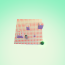

[Home](..)/[Resources](.)/Obstacle Course

## Obstacle Course
  

* Lesson 5: Obstacle Course
* Student Ages: 8-14 years old
* Activity Time: 50 minutes 
* Activity Level: Beginner Coder

### Prerequisites
* Download and Installation of Kodu
* [Lesson 1: Growing Squares](growing_squares)
* [Lesson 2: Length, Width, Area, and Perimeter](length_width_area_and_perimeter)
* [Lesson 3: Area, Perimeter, and Volume](area_perimeter_and_volume)
* [Lesson 4: Surface Area and Volume](surface_area_and_volume)  
* Lesson 5: Print Student Activity:
  * [Obstacle Course Construction](6_Kodu_Curriculum_Math_Module.pdf#page=41) (1 per student)
  * [Obstacle Course Mini-Game](6_Kodu_Curriculum_Math_Module.pdf#page=41) (1 per student)
* Lesson 5: Present Teacher Resources:
  * Completed Game: [Flying Blimp](<https://www.kodugamelab.com/worlds/#adNUNlk_pEKJqDDbRoLMJQ==>)
  * Completed Game: [Flying Blimp with obstacles](<https://www.kodugamelab.com/worlds/#Bf6jissB40ugXzj7hb3H1w==>)
  * Completed Game: [Obstacle Course](<https://www.kodugamelab.com/worlds/#Jke0ZOagVkeROoIlLIHngQ==>)

### Learning Objectives
* Students will design a computer simulation to represent the situation, analyze the resulting data, and display the data in a table or graph.
* Students will represent that object as a three-dimensional shape in a coordinate plane when given an object’s properties such as length, width, height, surface area, volume, and location.

### Contents
* [Activator](#activator)
* [Obstacle Course Game Demonstration](#demo)
* [Placement by Location](#placement)

### Student Activities

[**Activator**](6_Kodu_Curriculum_Math_Module.pdf#page=38) 
Students will complete the Student Activity: [Obstacle Course Mini-Game](6_Kodu_Curriculum_Math_Module.pdf#page=41). Students will use their pencil to draw paths to navigate an obstacle course. Students will draw lines from the starting point to each target and then come back to the starting point. Students will learn that the game they just played represents a common problem people have in deciding which paths are the most efficient between different locations. Students will create an obstacle course composed of the 3D quadrilaterals that they have been studying. The shapes will be designed according to detailed specifications.
*Subjects: Math, Computer Science, Digital Technology, Engineering, 21st Century Learning*

[**Obstacle Course Game Demonstration**](6_Kodu_Curriculum_Math_Module.pdf#page=38)
The teacher should demo the Completed Game: [Obstacle Course](https://www.kodugamelab.com/worlds/#Jke0ZOagVkeROoIlLIHngQ==). The students will observe the grid that the world exists on. The students will observe the raised shapes of different sizes at different locations on the grid that compose the landscape of the game. Students will observe how to play the game. Students will observe the code for the Kodu, tree, apples, and timer. Students will observe the extra decorations and objects that compose the world.
*Subjects: Subjects: Math, Computer Science, Digital Technology, Engineering, 21st Century Learning*

### Performance Expectations

[**Placement by Location**](6_Kodu_Curriculum_Math_Module.pdf#page=39)
Students should load a new world. Students will immediately save the world and give it a title. The student's title should reflect the nature of the game. Students will create a world that starts as a 20 x 20 grid located. Students will change the brush size to 20 x 20. Students will learn to keep an overhead camera view throughout the grid placement process. Students will create the required obstacles as detailed in the specification sheet: [Obstacle Course Construction](6_Kodu_Curriculum_Math_Module.pdf#page=41). The teacher could create the first obstacle with the students to review how to maneuver the camera and change the brush size. Students will be following pair programming rules to collaborate. 

### Skills
Character,
Citizenship,
Collaboration,
Communication,
Creativity,
Critical Thinking,
Project Based Learning
