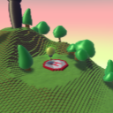

[Home](..)/[Resources](.)/Open Ended Developer Experience, part 1

## Open Ended Developer Experience, part 1
 

* [Lesson plan 6: Open Ended Developer Experience, part 1](6_Lesson_Kodu_Makerspace.pdf)
* [Slides for lesson 6](6_Slides_Kodu_Makerspace.pdf#page=1) and [PowerPoint source](Lesson_6_Teacher_Resources.zip>)
* Student Ages: 9-14 years old
* Activity Time: 45-60 minutes
* Activity Level: Beginner Coder

### Prerequisites 
* Download and Installation of Kodu
* [Lesson 1: Managed Test Drive](managed_test_drive)
* [Lesson 2: Guided Investigation](guided_investigation)
* [Lesson 3: Exploring Developer Experience, part 1](exploring_developer_experience_part_1)
* [Lesson 4: Exploring Developer Experience, part 2](exploring_developer_experience_part_2)
* [Lesson 5: Creative Collaboration](creative_collaboration)

### Learning Objectives
* Share draft version with the class
* Assess plan revision ideas
* Collaborate to create a game from plans
* Gather and assess feedback
* Seek peer experts
* Revise game

### Contents
* [Lesson plan 6: Open Ended Developer Experience, part 1](6_Lesson_Kodu_Makerspace.pdf)
* [Slides for lesson 6](6_Slides_Kodu_Makerspace.pdf#page=1) and [PowerPoint source](Lesson_6_Teacher_Resources.zip>)
* Lesson 6: Print Student Guide:
  * [Open-ended Developer Experience, part 1](Student_Guide_Kodu_Makerspace.pdf#page=20) (1 per student)
* Lesson 6: Present Teacher Resources:
  * [Lesson 6 Open-ended Developer Experience, part 1](6_Lesson_Kodu_Makerspace.pdf)
  * [Completed Game:Flashy Fishbots](<http://worlds.kodugamelab.com/world/sQSa7QMWL06j_Z0r8xuKOA==>)
  * [Completed Game:Fishbots Plus](<http://worlds.kodugamelab.com/world/0KvbV5Bj1EumEjTESqEKDw==>)
  * [Completed: Boku's Amazing Race](<http://worlds.kodugamelab.com/world/3M1kkWjzb0ateucfWn9LcQ==>)
  * [Completed: Air Delivery](<http://worlds.kodugamelab.com/world/cNsGpAT6CU6OtEFDEyGbcQ==>)
  * [Tutorial Lesson: Air Delivery](<http://worlds.kodugamelab.com/world/yYHLLX5_SEerL6HIiQEPbQ==>)

### Student Activities
[**Getting Started: Big Question Review**](6_Lesson_Kodu_Makerspace.pdf#page=3) 
Introduce with Big Questions for this lesson on [Slide 2](6_Slides_Kodu_Makerspace.pdf#page=2). 
*Subjects: Computer Science, Design Technology, Digital Literacy, 21st Century Learning Skills*

[**Show and Tell**](6_Lesson_Kodu_Makerspace.pdf#page=3) 
Direct students to page 21 of the Student Workbook: [First Draft Show and Tell](Student_Guide_Kodu_Makerspace.pdf#page=21). The teacher could refer to the guided writing prompts [Slide 3](6_Slides_Kodu_Makerspace.pdf#page=3). The teacher should model how to "show and tell" their games using [Fishbots Plus](<http://worlds.kodugamelab.com/world/0KvbV5Bj1EumEjTESqEKDw==>) Students should be shown how to open their game, use the projector to display their game; show how the game works; tell students about the game; follow the four prompts using the Activity checklist: ["Show and Tell"](Student_Guide_Kodu_Makerspace.pdf#page=21). The teacher will support students with the Show and Tell presentations by keeping the time within two minutes; call a stop, and time for feedback; lead students to provide feedback using the Wows, Wonders, and Wants feedback strategy. Continue the loop until all teams have presented their games and have received feedback. Students listing to a presentation will complete the feedback using the Student Guide: Activity ["Wows, Wonders, and Wants"](Student_Guide_Kodu_Makerspace.pdf#page=22) 
*Subjects: Computer Science, Design Technology, Digital Literacy, 21st Century Learning Skills*

[**Assessing Feedback**](6_Lesson_Kodu_Makerspace.pdf#page=5) 
After all of the presentations, instruct teams to consider the suggestions they received from their peers. The teacher could display feedback prompts for the presenting teams on [Slide 6](6_Slides_Kodu_Makerspace.pdf#page=6). 
*Subjects: Computer Science, Design Technology, Digital Literacy, 21st Century Learning Skills*

[**Seeking Experts**](6_Lesson_Kodu_Makerspace.pdf#page=6) 
Allow students to talk among themselves to discover “experts” in the classroom. The teacher could display team discussion prompts [Slide 7](6_Slides_Kodu_Makerspace.pdf#page=7). Each team could select something they would like to do in their game and to ask the classmates if anyone knows how to do that. 
*Subjects: Computer Science, Design Technology, Digital Literacy, 21st Century Learning Skills*

[**Design tweaking**](6_Lesson_Kodu_Makerspace.pdf#page=6) 
After teams have decided upon the revisions they want to make to their game, they should either draw or list their plans on a planning document and by following the guided prompts on [Slide 8](6_Slides_Kodu_Makerspace.pdf#page=8). Each team could select something they would like to do in their game and to ask the classmates if anyone knows how to do that. 
*Subjects: Computer Science, Design Technology, Digital Literacy, 21st Century Learning Skills*

[**Wrap up**](6_Lesson_Kodu_Makerspace.pdf#page=6) 
Students should think of a name for their game. They should write it on their planning design. Students should review their plans by completing the next steps displayed on the teacher’s screen. [Slide 9](6_Slides_Kodu_Makerspace.pdf#page=9). Students collaborative and share some of the best ideas they got from their peers for changing their games. 
*Subjects: Computer Science, Design Technology, Digital Literacy, 21st Century Learning Skills*

### Performance Expectations
Students will collaborate in sharing their games in a Gallery Walk. It is suggested that students present their work in a Gallery Walk style where students walk around the classroom, observe classmate work, and make comments with post it notes. Set the Gallery Walk in the context of visiting a museum or art gallery. Museum attendees generally walk through the exhibits in an orderly fashion along a path that ensures they will see every exhibits. Establish the process for circling the room and leaving comments to the creators prior to the walk to ensure a smooth process.

### Skills
Character,
Citizenship,
Collaboration,
Communication,
Creativity,
Critical Thinking,
Project Based Learning

