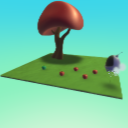

[Home](..)/[Resources](.)/Placing and Customizing Objects

## Placing and Customizing Objects
 

* [Lesson plan 2: Placing and Customizing Objects](Kodu_Touch_Primer_Lesson_2.pdf)
* Student Ages: 9-14 years old
* Activity Time: 60 minutes
* Activity Level: Beginner Coder

### Prerequisites 
* Download and Installation of Kodu
* [Lesson 1: Introduction to Kodu Touch](introduction_to_kodu_touch)

### Learning Objectives
* Choose the appropriate tool for a task by selecting to either paint terrain or place an object.
* Traverse a hierarchy of menu options to specify the action of a tool.
* Place an object by double-clicking on an intended location.
* Change an object’s color, size, and orientation.

### Contents
* [Lesson 2: Introduction to Kodu Touch](Kodu_Touch_Primer_Lesson_2.pdf#page=1)
* [Starter World: Kodu Touch Lesson 2 (Apples, Tree, and Kodu) ](https://www.kodugamelab.com/worlds/#z1iDdhN3PkSfHiJlgExGCA==)

### Student Activities
[Activity: Kodu Kraft](Kodu_Touch_Primer_Lesson_2.pdf#page=1) 
The teacher can display the Kodu Starter World: Kodu Touch for Little Kids Lesson 2. It contains apples, a tree, and kodu. Students will make a mock-up of the world they will later create in Kodu. Students will draw their own land and color it in. Students can draw and color the Kodu, tree, and apples as they desire. 
*Subjects: Design Technology, Digital Literacy, 21st Century Learning Skills*

[Placing and Customizing Objects](Kodu_Touch_Primer_Lesson_2.pdf#page=1) 
Students will should load the world the previously saved world from Lesson 1. Students will place apples, trees, and the Kodu in their worlds. Students will move the objects around in the world, by clicking and dragging, to represent the scenario from the Kodu Kraft activity. 
*Subjects: Design Technology, Digital Literacy, 21st Century Learning Skills*

### Skills
Character,
Citizenship,
Collaboration,
Communication,
Creativity,
Critical Thinking,
Project Based Learning 

