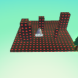

[Home](..)/[Resources](.)/Placing and Programming Items

## Obstacle Course
  

* [Lesson 6: Placing and Programming Items](6_Kodu_Curriculum_Math_Module.pdf#page=43)
* Student Ages: 8-14 years old
* Activity Time: 50 minutes 
* Activity Level: Beginner Coder

### Prerequisites
* Download and Installation of Kodu
* [Lesson 1: Growing Squares](growing_squares)
* [Lesson 2: Length, Width, Area, and Perimeter](length_width_area_and_perimeter)
* [Lesson 3: Area, Perimeter, and Volume](area_perimeter_and_volume)
* [Lesson 4: Surface Area and Volume](surface_area_and_volume)  
* [Lesson 5: Obstacle Course](obstacle_course)
* Lesson 6: Print Student Activity:
  * [Placing Items](6_Kodu_Curriculum_Math_Module.pdf#page=47) (1 per student)
* Lesson 6: Present Teacher Resources:
  * Completed Game: [Obstacle Course - Stage 1 (pink terrain)](https://www.kodugamelab.com/worlds/#hZemyy6GOEGOu483QwIGTQ==)
  * Completed Game: [Obstacle Course - Stage 1 (black terrain)](https://www.kodugamelab.com/worlds/#HdaeSwIuKUmdSEie6b4RGQ==)
  * Completed Game: [Obstacle Course - Stage 1 (white terrain)](https://www.kodugamelab.com/worlds/#SKbVVDUvB0CgzPT9xyjt7g==)

### Learning Objectives
* Students will represent that object as a three-dimensional shape in a coordinate plane when given an object’s properties such as length, width, height, surface area, volume, and location.
* Students will place that object at pre-designated and student-determined locations in a coordinate plane when given an object.
* Students will represent it as a When...Do... statement in Kodu when given a condition and consequence.

### Contents
* [Activator](#activator)
* [Placing and Programming an Apple to Score and Disappear](#placing)
* [Copying an Object](#copying)

### Student Activities

[**Activator**](6_Kodu_Curriculum_Math_Module.pdf#page=44) 
Students will provide 2-3 pieces of feedback for other students who are creating the Kodu obstacle course made of shapes. Students collaborate by sharing their responses as a class discussion. Students will start to program the apples to score a point and disappear when bumped.
*Subjects: Math, Computer Science, Digital Technology, Engineering, 21st Century Learning*

[**Placing and Programming an Apple to Score and Disappear**](6_Kodu_Curriculum_Math_Module.pdf#page=44) 
Students will explore and run [Obstacle Course - Stage 1](https://www.kodugamelab.com/worlds/#t1I4yjCkcUiUcDV0WIjlWw==). The world contains obstacles, but not apples. Students will learn to select an apple and place it in the world. The teacher could demonstrate how to create a WHEN-DO statement. Students will learn to program the object (apple) after the character (kodu) bumped it. After the character bumped an apple, students will learn to program the object to vanish and score a point for the character. Students will learn that a WHEN-DO statement is a conditional statement. Students will learn that an action is based on a condition being met. Only when the apple is touched will it score a point and disappear. Students will learn that the WHEN part of the statement is the condition. Students will explore and play their game. Students will add a Kodu to the game and program it to move. Students will test the game by having Kodu bump an apple to ensure the apple (object) vanishes and a point appears.
*Subjects: Subjects: Math, Computer Science, Digital Technology, Engineering, 21st Century Learning*

[**Copying an Object**](6_Kodu_Curriculum_Math_Module.pdf#page=45) 
Students will create at least 5 apples total. Students should copy and paste the object. Students will learn that additional apples contain the same code as the initial apple. Students will receive the Student Activity: [Placing Items](6_Kodu_Curriculum_Math_Module.pdf#page=47). Students will place items in the world. Students can decorate their worlds or try extra programming tasks. Students can try to have a conversation with Kodu. Students can try to program Kodu to bump an apple and say, "Yippee!"
*Subjects: Subjects: Math, Computer Science, Digital Technology, Engineering, 21st Century Learning*

### Skills
Character,
Citizenship,
Collaboration,
Communication,
Creativity,
Critical Thinking,
Project Based Learning
